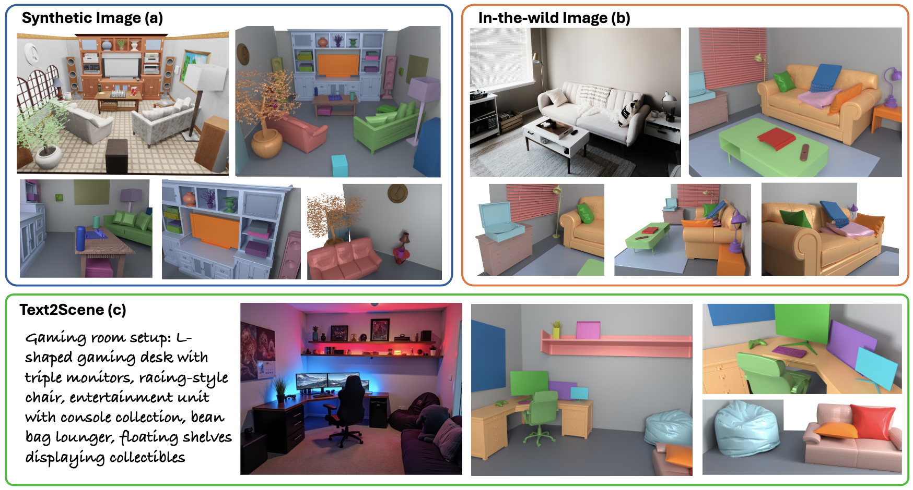

# Diorama

### Diorama: Unleashing Zero-shot Single-view 3D Scene Modeling


[Qirui Wu](https://qiruiw.github.io/), [Denys Iliash](), [Daniel Ritchie](https://dritchie.github.io/), [Manolis Savva](https://msavva.github.io/), [Angel X. Chang](http://angelxuanchang.github.io/)


Preprint

[Website](https://3dlg-hcvc.github.io/diorama/) | [arXiv](https://arxiv.org/abs/2411.19492) 

\
**TL;DR**: Our work is driven by the question *"Is holistic 3D scene modeling from a single-view real-world image possible using foundation models?"* To answer it, we present **Diorama: a modular zero-shot open-world system that models synthetic holistic 3D scenes given an image and requires no end-to-end training**.




## Bibtex
```
@article{wu2024diorama,
  title={Diorama: Unleashing Zero-shot Single-view 3D Scene Modeling},
  author={Wu, Qirui and Iliash, Denys and Ritchie, Daniel and Savva, Manolis and Chang, Angel X},
  journal={arXiv preprint arXiv:2411.19492},
  year={2024}
}
```
